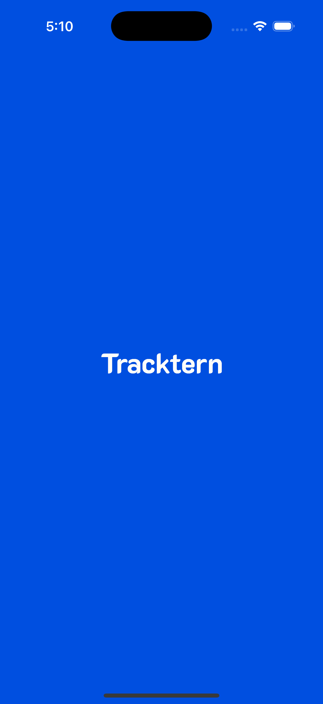
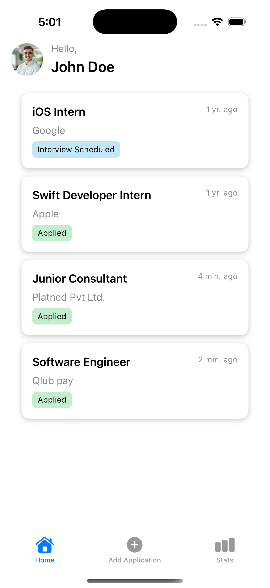
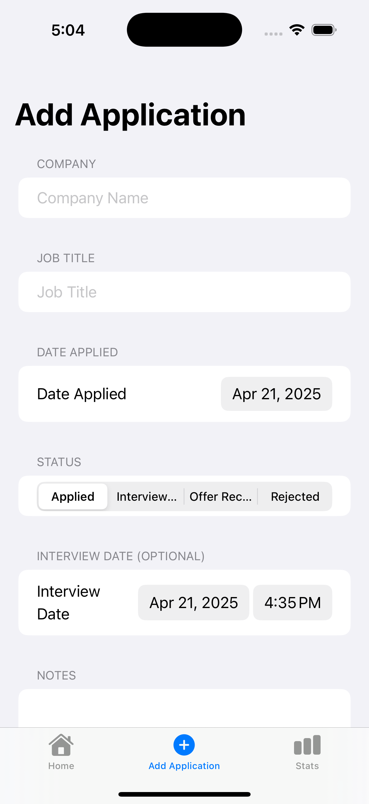
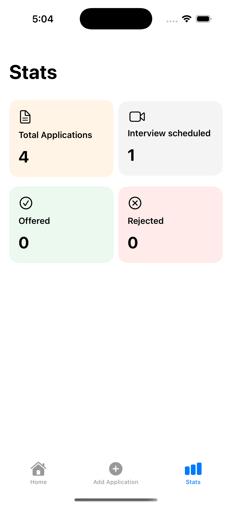
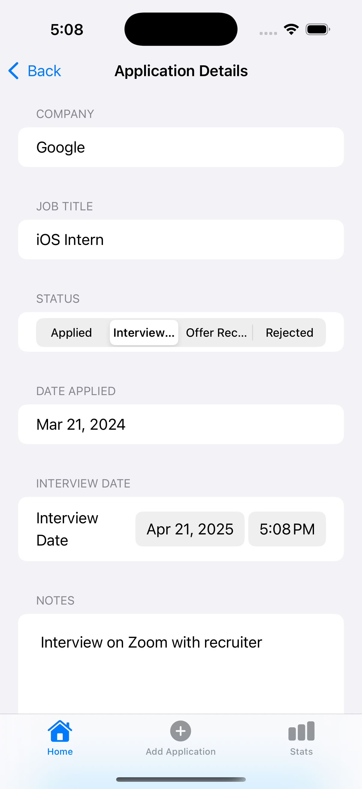

# Project Name - Tracktern
# Student Id - IT21171338
# Student Name - Tennakoon T. M. T. C.

#### 01. Brief Description of Project 
Tracktern is a SwiftUI-based iOS app designed to help students and job seekers track their internship or job applications in one place. The app allows users to add, edit, and view job applications along with interview schedules, notes, and application statuses. It also supports local notifications for upcoming interviews.
#### 02. Users of the System
- Primary users: Students and interns applying for multiple job positions  
- The system is designed to be single-user, without login
#### 03. What is unique about your solution
- Solves a common but overlooked problem among students: losing track of job/internship applications  
- Includes a micro-journaling feature with notes and interview schedules  
- Clean, minimalist design focused only on what’s essential  
- Sends local notifications for scheduled interviews  
#### 04. Briefly document the functionality of the screens you have (Include screen shots of images)
- **Home Screen:** Lists all job applications in card format with status badges  
- **Add Application Screen:** Lets the user input company name, job title, date applied, status, notes, and optional interview date  
- **Detail View:** Shows full info for an application, allows updates to notes, status, and interview date  
- **Stats Screen:** Summarizes how many applications are in each status








#### 05. Give examples of best practices used when writing code

- **Consistent Naming**: Used camelCase for variables, PascalCase for types, and clear enum cases.

- **Enums for Status**: Application status handled using `enum` for safety and easy picker use.
```
enum ApplicationStatus: String, CaseIterable, Codable, Identifiable {
    case applied = "Applied"
    case interview = "Interview Scheduled"
    case offer = "Offer Received"
    case rejected = "Rejected"
    
    var id: String { self.rawValue }
}

```

- **Modular Structure**: Project follows MVVM-style separation—Models, ViewModels, Views, and Services.

- **Reusable Components**: `ApplicationCardView` and `StatRow` help reduce code duplication.

- **Optional Handling**: Fields like `interviewDate` use safe bindings to avoid crashes.

- **Input Validation**: Alerts are shown for missing fields or successful saves.

- **SwiftUI Practices**: Proper use of `@State`, `@Binding`, `TabView`, `NavigationStack`, and clean layout formatting.

#### 06. UI Components used

- TabView

- NavigationStack

- List, Form

- TextField, TextEditor, DatePicker, Picker

- Button, Alert, Spacer, VStack, HStack

- UNUserNotificationCenter (for scheduling local notifications)

#### 07. Testing carried out

- Manually tested all flows: add, edit, navigate, update status

- Tested edge cases like:

- Empty field validation

- Interview date notification triggering

- Handling optional fields safely

#### 08. Documentation 

##### (a) Design Choices
- Clean, two-color scheme (blue for actions, gray for info)

- Bottom-tab navigation for accessibility

- Form-based layout for quick entry

##### (b) Implementation Decisions
- Used JSON file for initial persistence (Firebase planned later)

- Used UUID as unique identifiers for entries

- Notifications scheduled using app ID for uniqueness


##### (c) Challenges
- Handling optional  `interviewDate` properly in pickers

- Scheduling notifications using local calendar time

- Getting alerts to behave contextually (error vs. success)

#### 09. Reflection

One challenge I faced was getting the DatePicker to work with optional dates, especially when scheduling local notifications only when a date was selected. Also, working without Firebase made me think creatively about how to simulate data persistence and still meet the requirements.
  
